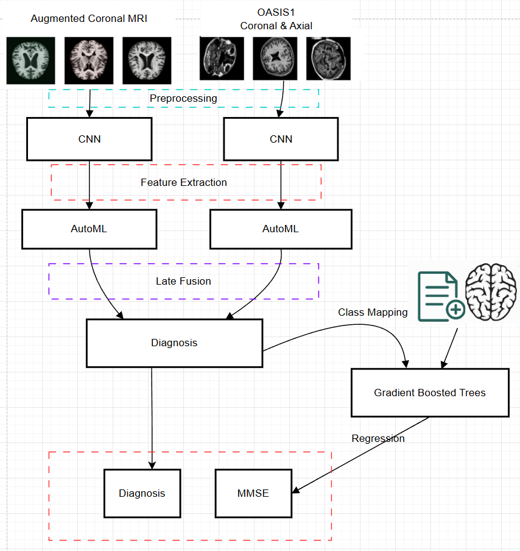
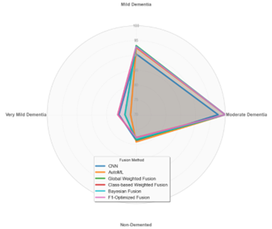
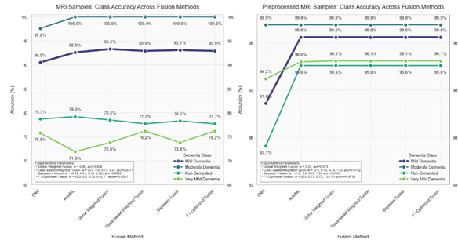

# 🧠 Master's Thesis: Multimodal Deep Learning Ensemble System for Alzheimer's Disease Classification and MMSE Estimation

This repository contains key components of my **master's thesis**, which explores **innovative multimodal deep learning approaches** for classifying cognitive states (CN / MCI / AD) and **estimating MMSE cognitive scores** from structural brain MRI and clinical data.

> ⚠️ This repository does **not** include the entire codebase due to size and privacy constraints. Only the **most significant models and logic** are shared to illustrate the methodology and results.

---

## 🧪 Project Overview

The goal of this research is to enhance early-stage Alzheimer's Disease detection through a multimodal pipeline combining:

- **Brain MRI images** (coronal + axial slices)
- **Augmented image data**
- **Clinical features** (FAQ, diagnosis)
- **Ensemble learning and late fusion techniques**
  - Global average fusion
  - Class-wise fusion (per-class optimization)
  - Bayesian optimization of fusion weights
  - Fusion guided by F1-Score performance
- **Gradient Boosted Trees for MMSE score prediction**

### 📌 Key Tasks

- Classify MRI into **Non-Demented**, **Very Mild Dementia**, **Mild Dementia**, or **Moderate Dementia**
- Predict **MMSE** score using clinical + system-based diagnostic outputs (as seen in the above schema)

---

## 📊 Results Summary
### 🧠 Fusion Performance (Radar Chart)

### 📊 Class Accuracy by Fusion Method

- **Best Overall Fusion Method:** F1-score (~97% overall accuracy)
- **Best MMSE Estimation (R²):** ~81.5% using GBT regressor on clinical + diagnostic data

---

## 📂 Dataset References

The project used a mix of public and clinical datasets, including raw and augmented MRIs, as well as ADNI metadata.

### 🧠 Brain Imaging Datasets

- [ImagesOASIS (Kaggle)](https://www.kaggle.com/datasets/ninadaithal/imagesoasis)
- [Augmented Alzheimer MRI Dataset](https://www.kaggle.com/datasets/uraninjo/augmented-alzheimer-mri-dataset/data)

### 🧾 Clinical + Cognitive Metadata

- ADNI (Alzheimer’s Disease Neuroimaging Initiative):  
  [https://adni.loni.usc.edu](https://adni.loni.usc.edu)
- `@misc{rabie_el_kharoua_2024,
  title={Alzheimer's Disease Dataset},
  url={https://www.kaggle.com/dsv/8668279},
  DOI={10.34740/KAGGLE/DSV/8668279},
  publisher={Kaggle},
  author={Rabie El Kharou},
  year={2024}
}`
---

## 📚 Citation

If you use or refer to this work, please cite:

**Cristina-Ioana Casapu**, **Simona Moldovanu**, 2025.  
"Innovative Approaches for Classifying Degenerative Brain Diseases"(Abordări inovative privind clasificarea bolilor degenerative cerebrale). Master’s Thesis, “Dunărea de Jos” University of Galați, 2025.

---
